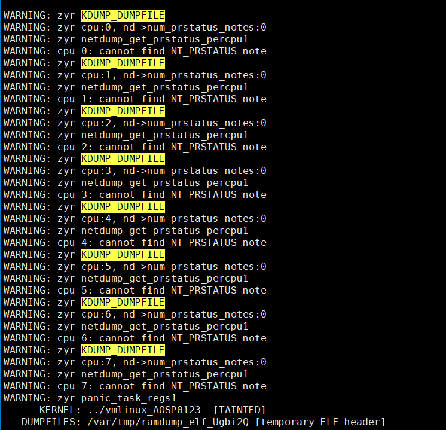

```c
else if (KDUMP_DUMPFILE()) {
        error(WARNING, "zyr KDUMP_DUMPFILE\n");
        note = netdump_get_prstatus_percpu(i);
}

if (!note) {
        error(WARNING, "cpu %d: cannot find NT_PRSTATUS note\n", i);
        continue;
}
```


```c
void *
netdump_get_prstatus_percpu(int cpu)
{
        int online;

        if ((cpu < 0) || (cpu >= nd->num_prstatus_notes)) {
                error(WARNING, "zyr cpu:%d, nd->num_prstatus_notes:%d\n",cpu,nd->num_prstatus_notes);
                error(WARNING, "zyr netdump_get_prstatus_percpu1\n");
                return NULL;
        }
        /*
         * If no cpu mapping was done, then there must be
         * a one-to-one relationship between the number
         * of online cpus and the number of notes.
         */
        if ((online = get_cpus_online()) &&
            (online == kt->cpus) &&
            (online != nd->num_prstatus_notes)) {
                error(WARNING, "zyr netdump_get_prstatus_percpu2\n");
                return NULL;
        }

        return nd->nt_prstatus_percpu[cpu];
}

```



nd->num_prstatus_notes:0


```
diskdump.c:188:			dd->num_prstatus_notes = 
diskdump.c:203:		    dd->num_prstatus_notes * sizeof(void *))) == NULL)
netdump.c:104:			nd->num_prstatus_notes =
```

