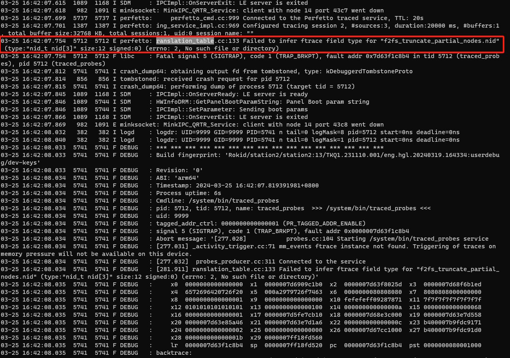

## 背景

station2使用perfetto得到的trace文件很小


## 分析

### 1.logcat查看日志




### 2.社区已知问题

[A crash happens in libperfetto.so when capture perfetto-trace · Issue #646 · google/perfetto (github.com)](https://github.com/google/perfetto/issues/646)


社区提交

[…/proto_translation_table.cc · Gerrit Code Review (googlesource.com)](https://android-review.googlesource.com/c/platform/external/perfetto/+/2583173/1/src/traced/probes/ftrace/proto_translation_table.cc)


### 测试验证

1.编译perfetto

```
cd la_qssi13
source build/envsetup.sh && lunch qssi-userdebug
mmma external/perfetto
# or
m traced traced_probes perfetto
```

编译参考：[Perfetto build instructions - Perfetto Tracing Docs](https://perfetto.dev/docs/contributing/build-instructions)

2.替换so和bin文件

```
out/target/product/qssi/system/lib64/libperfetto.so
out/target/product/qssi/system/bin/perfetto
```


