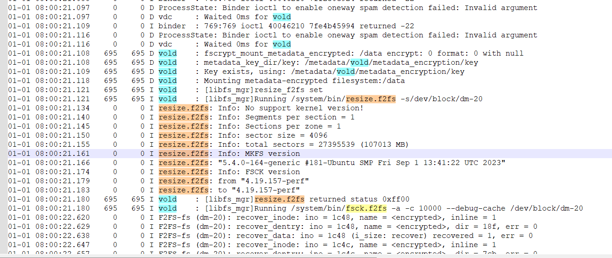
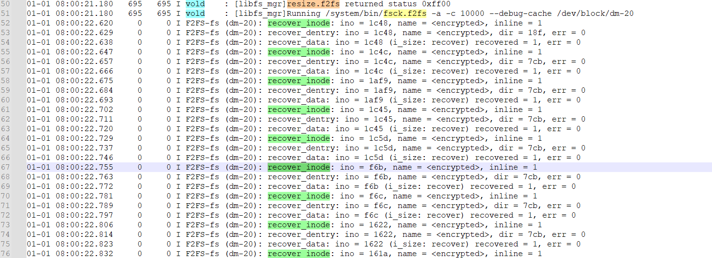

## 1.背景

系统启动后蓝灯一直闪烁，重启也是相同的现象。

拆机后连接串口，开机启动，一直报recover_data，经过一段很长的时间后，系统恢复正常





```c++
binder::Status VoldNativeService::mountFstab(const std::string& blkDevice,
                                             const std::string& mountPoint) {
    ENFORCE_SYSTEM_OR_ROOT;
    ACQUIRE_LOCK;

    return translateBool(
            fscrypt_mount_metadata_encrypted(blkDevice, mountPoint, false, false, "null"));
}
```


> Usage: fsck.f2fs [options] device
> [options]:
>   -a check/fix potential corruption, reported by f2fs
>   -c <num-cache-entry>  set number of cache entries (default 0)
>   -m <max-hash-collision>  set max cache hash collision (default 16)
>   -C encoding[:flag1,flag2] Set options for enabling casefolding
>   -d debug level [default:0]
>   -f check/fix entire partition
>   -g add default options
>   -l show superblock/checkpoint
>   -O feature1[feature2,feature3,...] e.g. "encrypt"
>   -p preen mode [default:0 the same as -a [0|1]]
>   -S sparse_mode
>   -t show directory tree
>   -q preserve quota limits
>   -y fix all the time
>   -V print the version number and exit
>   --dry-run do not really fix corruptions
>   --no-kernel-check skips detecting kernel change
>   --kernel-check checks kernel change
>   --debug-cache to debug cache when -c is used


1.查看日志是进行fsck修复工作

2.本地暂时无法执行fsck操作，无法进行umount data分区的操作


## 2.resize_f2fs

```c
} else if (is_f2fs(entry.fs_type)) {
    if (!read_f2fs_superblock(blk_device, &fs_stat)) {
        return fs_stat;
    }
    /*add for resizeof /data/ 20231019 ,for recovery-mode*/
    #ifdef RECOVERY_MODE_BUG
    LINFO << "resize_f2fs set ";
    resize_f2fs(blk_device);
    #endif
}
```


```c
static bool read_f2fs_superblock(const std::string& blk_device, int* fs_stat) {
    android::base::unique_fd fd(TEMP_FAILURE_RETRY(open(blk_device.c_str(), O_RDONLY | O_CLOEXEC)));
    __le32 sb1, sb2;

    if (fd < 0) {
        PERROR << "Failed to open '" << blk_device << "'";
        return false;
    }

    if (TEMP_FAILURE_RETRY(pread(fd, &sb1, sizeof(sb1), F2FS_SUPER_OFFSET)) != sizeof(sb1)) {
        PERROR << "Can't read '" << blk_device << "' superblock1";
        return false;
    }
    if (TEMP_FAILURE_RETRY(pread(fd, &sb2, sizeof(sb2), F2FS_BLKSIZE + F2FS_SUPER_OFFSET)) !=
        sizeof(sb2)) {
        PERROR << "Can't read '" << blk_device << "' superblock2";
        return false;
    }

    if (sb1 != cpu_to_le32(F2FS_SUPER_MAGIC) && sb2 != cpu_to_le32(F2FS_SUPER_MAGIC)) {
        LINFO << "Invalid f2fs superblock on '" << blk_device << "'";
        *fs_stat |= FS_STAT_INVALID_MAGIC;
        return false;
    }
    return true;
}
```


### 疑问1：读取f2fs的超级块信息成功，为啥要进行resize f2fs操作？

确保文件系统大小和实际的剩余文件系统大小空间一致


> 01-01 08:00:21.121   695   695 I vold    : [libfs_mgr]resize_f2fs set 
> 01-01 08:00:21.121   695   695 I vold    : [libfs_mgr]Running /system/bin/resize.f2fs -s/dev/block/dm-20
> 01-01 08:00:21.134     0     0 I resize.f2fs: Info: No support kernel version!
> 01-01 08:00:21.140     0     0 I resize.f2fs: Info: Segments per section = 1
> 01-01 08:00:21.145     0     0 I resize.f2fs: Info: Sections per zone = 1
> 01-01 08:00:21.150     0     0 I resize.f2fs: Info: sector size = 4096
> 01-01 08:00:21.155     0     0 I resize.f2fs: Info: total sectors = 27395539 (107013 MB)
> 01-01 08:00:21.161     0     0 I resize.f2fs: Info: MKFS version
> 01-01 08:00:21.166     0     0 I resize.f2fs: "5.4.0-164-generic #181-Ubuntu SMP Fri Sep 1 13:41:22 UTC 2023"
> 01-01 08:00:21.174     0     0 I resize.f2fs: Info: FSCK version
> 01-01 08:00:21.179     0     0 I resize.f2fs: from "4.19.157-perf"
> 01-01 08:00:21.183     0     0 I resize.f2fs: to "4.19.157-perf"
> 01-01 08:00:21.180   695   695 I vold    : [libfs_mgr]resize.f2fs returned status 0xff00

0xff00返回值含义？


## 3.fsck.f2fs

```c++
//mount前对fs进行操作
prepare_fs_for_mount
	resize_f2fs
    check_fs
		fsck.f2fs

else if (is_f2fs(fs_type)) {
    const char* f2fs_fsck_argv[] = {F2FS_FSCK_BIN,     "-a", "-c", "10000", "--debug-cache",
                                    blk_device.c_str()};
    const char* f2fs_fsck_forced_argv[] = {
            F2FS_FSCK_BIN, "-f", "-c", "10000", "--debug-cache", blk_device.c_str()};

    if (should_force_check(*fs_stat)) {
        LINFO << "Running " << F2FS_FSCK_BIN << " -f -c 10000 --debug-cache "
              << realpath(blk_device);
        ret = logwrap_fork_execvp(ARRAY_SIZE(f2fs_fsck_forced_argv), f2fs_fsck_forced_argv,
                                  &status, false, LOG_KLOG | LOG_FILE, false, nullptr);
    } else {
        LINFO << "Running " << F2FS_FSCK_BIN << " -a -c 10000 --debug-cache "
              << realpath(blk_device);
        ret = logwrap_fork_execvp(ARRAY_SIZE(f2fs_fsck_argv), f2fs_fsck_argv, &status, false,
                                  LOG_KLOG | LOG_FILE, false, nullptr); //called
    }

```





recover_inode -> recover_dentry -> recover_data

```c
f2fs_fill_super
	f2fs_recover_fsync_data
		recover_data
			recover_inode
			recover_dentry
			do_recover_data
```

​		

```c
//fs/f2fs/recovery.c
static int recover_inode(struct inode *inode, struct page *page)
{
    ...
    f2fs_notice(F2FS_I_SB(inode), "recover_inode: ino = %x, name = %s, inline = %x",
                    ino_of_node(page), name, raw->i_inline);
    return 0;
}
```


```c
static int recover_data(struct f2fs_sb_info *sbi, struct list_head *inode_list,
                struct list_head *tmp_inode_list, struct list_head *dir_list)
{
	...
	while(1) {
		...
		if (IS_INODE(page)) {
            err = recover_inode(entry->inode, page); //called
            if (err) {
                    f2fs_put_page(page, 1);
                    break;
            }
        }
        if (entry->last_dentry == blkaddr) {
            err = recover_dentry(entry->inode, page, dir_list); //called
            if (err) {
                    f2fs_put_page(page, 1);
                    break;
            }
        }
        ...
	}
	...
}
```


### 疑问2：ino=948少了recover_dentry流程？


### 疑问3：尝试本地复现查看没加resize.f2fs的logcat日志中是否存在fsck的报错，如果有说明和resize.f2fs无关

复现方法：并行执行增加文件脚本；同步进行删除操作，会看到IO error，后续设备红灯，抓取过dump信息后，设备进入recovery模式


## 4.oops

> [ 3827.193599] ------------[ cut here ]------------
> [ 3827.193621] WARNING: CPU: 7 PID: 20047 at fs/f2fs/segment.c:2600 change_curseg+0x320/0x388
> [ 3827.193621] Modules linked in: wlan(O) machine_dlkm(O) wcd938x_slave_dlkm(O) wcd938x_dlkm(O) wcd9xxx_dlkm(O) mbhc_dlkm(O) tx_macro_dlkm(O) rx_macro_dlkm(O) va_macro_dlkm(O) wsa_macro_dlkm(O) swr_ctrl_dlkm(O) bolero_cdc_dlkm(O) wsa881x_dlkm(O) wcd_core_dlkm(O) stub_dlkm(O) hdmi_dlkm(O) swr_dlkm(O) pinctrl_lpi_dlkm(O) pinctrl_wcd_dlkm(O) usf_dlkm(O) native_dlkm(O) platform_dlkm(O) q6_dlkm(O) adsp_loader_dlkm(O) apr_dlkm(O) s
> nd_event_dlkm(O) q6_notifier_dlkm(O) q6_pdr_dlkm(O) msm_11ad_proxy
> [ 3827.193644] CPU: 7 PID: 20047 Comm: kworker/u16:18 Tainted: G S      W  O      4.19.157-perf #1
> [ 3827.193645] Hardware name: Qualcomm Technologies, Inc. kona-xr-overlay Standalone (DT)
> [ 3827.193649] Workqueue: writeback wb_workfn (flush-252:6)
> [ 3827.193651] pstate: 60c00005 (nZCv daif +PAN +UAO)
> [ 3827.193652] pc : change_curseg+0x320/0x388
> [ 3827.193653] lr : change_curseg+0x318/0x388
> [ 3827.193653] sp : ffffff80120f3400
> [ 3827.193654] x29: ffffff80120f3420 x28: 0000000000000002 
> [ 3827.193655] x27: 0000000000000002 x26: fffffffbc7368d54 
> [ 3827.193656] x25: 0000000000000340 x24: fffffffbc7368d10 
> [ 3827.193657] x23: fffffffbc52a8348 x22: fffffffbc7368cf0 
> [ 3827.193658] x21: 0000000000000001 x20: ffffffffffffff8b 
> [ 3827.193659] x19: fffffffbc72e6000 x18: 0000000000000034 
> [ 3827.193659] x17: ffffffae55466000 x16: 0000000000000050 
> [ 3827.193660] x15: 0000000000000050 x14: 0000000000000086 
> [ 3827.193661] x13: 0000000000000034 x12: 0000000000000000 
> [ 3827.193662] x11: 0000000000000000 x10: ffffffae54d99a58 
> [ 3827.193663] x9 : 15bbbd23809c8500 x8 : 15bbbd23809c8500 
> [ 3827.193664] x7 : 0000000000000000 x6 : fffffffbffacf240 
> [ 3827.193665] x5 : 0000000000000000 x4 : 0000000000000006 
> [ 3827.193666] x3 : 0000000000002d2d x2 : fffffffbffbe6c98 
> [ 3827.193667] x1 : fffffffbc72e6050 x0 : 0000000000000004 
> [ 3827.193668] Call trace:
> [ 3827.193670]  change_curseg+0x320/0x388
> [ 3827.193672]  allocate_segment_by_default+0x17c/0x1cc
> [ 3827.193673]  f2fs_allocate_data_block+0x4d4/0x770
> [ 3827.193674]  do_write_page+0x80/0x1a8
> [ 3827.193675]  f2fs_outplace_write_data+0x58/0x130
> [ 3827.193676]  f2fs_do_write_data_page+0x3e4/0x7d8
> [ 3827.193677]  f2fs_write_single_data_page+0x4d8/0x780
> [ 3827.193678]  f2fs_write_data_pages+0x4d8/0x700
> [ 3827.193681]  do_writepages+0x64/0x118
> [ 3827.193682]  __writeback_single_inode+0xdc/0x4b0
> [ 3827.193683]  writeback_sb_inodes+0x468/0x9e0
> [ 3827.193684]  __writeback_inodes_wb+0xa4/0x1b0
> [ 3827.193685]  wb_writeback+0x270/0x438
> [ 3827.193686]  wb_workfn+0x3a8/0x630
> [ 3827.193689]  process_one_work+0x27c/0x448
> [ 3827.193690]  worker_thread+0x264/0x4b0
> [ 3827.193691]  kthread+0x144/0x158
> [ 3827.193693]  ret_from_fork+0x10/0x1c
> [ 3827.193694] ---[ end trace e0724141b9490fbe ]---
> [ 3827.193697] Unable to handle kernel paging request at virtual address ffffffffffffe2c0
> [ 3827.202313] Mem abort info:
> [ 3827.205220]   ESR = 0x96000005
> [ 3827.206126] init: Service 'logcatd' (pid 1702) exited with status 1
> [ 3827.208419] init: Sending signal 9 to service 'logcatd' (pid 1702) process group...
> [ 3827.208469]   Exception class = DABT (current EL), IL = 32 bits
> [ 3827.208531] libprocessgroup: Successfully killed process cgroup uid 1036 pid 1702 in 0ms
> [ 3827.214626]   SET = 0, FnV = 0
> [ 3827.217814]   EA = 0, S1PTW = 0
> [ 3827.220899] init: starting service 'logcatd'...
> [ 3827.221090] Data abort info:
> [ 3827.224208]   ISV = 0, ISS = 0x00000005
> [ 3827.228169]   CM = 0, WnR = 0
> [ 3827.231219] swapper pgtable: 4k pages, 39-bit VAs, pgdp = 000000004968e943
> [ 3827.238314] [ffffffffffffe2c0] pgd=0000000000000000, pud=0000000000000000
> [ 3827.245316] Internal error: Oops: 96000005 [#1] PREEMPT SMP
> [ 3827.251036] Modules linked in: wlan(O) machine_dlkm(O) wcd938x_slave_dlkm(O) wcd938x_dlkm(O) wcd9xxx_dlkm(O) mbhc_dlkm(O) tx_macro_dlkm(O) rx_macro_dlkm(O) va_macro_dlkm(O) wsa_macro_dlkm(O) swr_ctrl_dlkm(O) bolero_cdc_dlkm(O) wsa881x_dlkm(O) wcd_core_dlkm(O) stub_dlkm(O) hdmi_dlkm(O) swr_dlkm(O) pinctrl_lpi_dlkm(O) pinctrl_wcd_dlkm(O) usf_dlkm(O) native_dlkm(O) platform_dlkm(O) q6_dlkm(O) adsp_loader_dlkm(O) apr_dlkm(O) snd_event_dlkm(O) q6_notifier_dlkm(O) q6_pdr_dlkm(O) msm_11ad_proxy
> [ 3827.295302] Process kworker/u16:18 (pid: 20047, stack limit = 0x00000000ec2b678c)
> [ 3827.302977] CPU: 7 PID: 20047 Comm: kworker/u16:18 Tainted: G S      W  O      4.19.157-perf #1
> [ 3827.311902] Hardware name: Qualcomm Technologies, Inc. kona-xr-overlay Standalone (DT)
> [ 3827.320031] Workqueue: writeback wb_workfn (flush-252:6)
> [ 3827.325484] pstate: 20c00005 (nzCv daif +PAN +UAO)
> [ 3827.330411] pc : __memcpy+0x100/0x180
> [ 3827.334173] lr : change_curseg+0x298/0x388
> [ 3827.338377] sp : ffffff80120f3400
> [ 3827.341783] x29: ffffff80120f3420 x28: 0000000000000002 
> [ 3827.347232] x27: 0000000000000002 x26: fffffffbc7368d54 
> [ 3827.352681] x25: 0000000000000340 x24: fffffffbc7368d10 
> [ 3827.358131] x23: fffffffbc52a8348 x22: fffffffbc7368cf0 
> [ 3827.363583] x21: 0000000000000001 x20: ffffffffffffff8b 
> [ 3827.369042] x19: fffffffbc72e6000 x18: 0000000000000034 
> [ 3827.374493] x17: ffffffae55466000 x16: 0000000000000050 
> [ 3827.379950] x15: 0000000000000050 x14: 0000000000000086 
> [ 3827.385400] x13: 0000000000000034 x12: 0000000000000000 
> [ 3827.390849] x11: 0000000000000000 x10: ffffffae54d99a58 
> [ 3827.396299] x9 : 15bbbd23809c8500 x8 : ffffffffffffe2c0 
> [ 3827.401747] x7 : 0000000000000000 x6 : fffffffbc8c2e000 
> [ 3827.407201] x5 : 0000000000000000 x4 : 0000000000000000 
> [ 3827.412651] x3 : 0000000000002d2d x2 : 0000000000000d80 
> [ 3827.418104] x1 : ffffffffffffe2c0 x0 : fffffffbc8c2e000 
> [ 3827.423554] Call trace:
> [ 3827.426073]  __memcpy+0x100/0x180
> [ 3827.429481]  allocate_segment_by_default+0x17c/0x1cc
> [ 3827.434582]  f2fs_allocate_data_block+0x4d4/0x770
> [ 3827.439410]  do_write_page+0x80/0x1a8
> [ 3827.443173]  f2fs_outplace_write_data+0x58/0x130
> [ 3827.447920]  f2fs_do_write_data_page+0x3e4/0x7d8
> [ 3827.452666]  f2fs_write_single_data_page+0x4d8/0x780
> [ 3827.457769]  f2fs_write_data_pages+0x4d8/0x700
> [ 3827.462340]  do_writepages+0x64/0x118
> [ 3827.466104]  __writeback_single_inode+0xdc/0x4b0
> [ 3827.470851]  writeback_sb_inodes+0x468/0x9e0
> [ 3827.475239]  __writeback_inodes_wb+0xa4/0x1b0
> [ 3827.479715]  wb_writeback+0x270/0x438
> [ 3827.483477]  wb_workfn+0x3a8/0x630
> [ 3827.486972]  process_one_work+0x27c/0x448
> [ 3827.564345]  worker_thread+0x264/0x4b0
> [ 3827.568197]  kthread+0x144/0x158
> [ 3827.571515]  ret_from_fork+0x10/0x1c


### 4.1 WARN_ON打印

```
[ 3827.193621] WARNING: CPU: 7 PID: 20047 at fs/f2fs/segment.c:2600 change_curseg+0x320/0x388
```


### 4.2 Unable to handle kernel paging request at virtual address

```
[ 3827.330411] pc : __memcpy+0x100/0x180
[ 3827.334173] lr : change_curseg+0x298/0x388
[ 3827.338377] sp : ffffff80120f3400
[ 3827.341783] x29: ffffff80120f3420 x28: 0000000000000002 
[ 3827.347232] x27: 0000000000000002 x26: fffffffbc7368d54 
[ 3827.352681] x25: 0000000000000340 x24: fffffffbc7368d10 
[ 3827.358131] x23: fffffffbc52a8348 x22: fffffffbc7368cf0 
[ 3827.363583] x21: 0000000000000001 x20: ffffffffffffff8b 
[ 3827.369042] x19: fffffffbc72e6000 x18: 0000000000000034 
[ 3827.374493] x17: ffffffae55466000 x16: 0000000000000050 
[ 3827.379950] x15: 0000000000000050 x14: 0000000000000086 
[ 3827.385400] x13: 0000000000000034 x12: 0000000000000000 
[ 3827.390849] x11: 0000000000000000 x10: ffffffae54d99a58 
[ 3827.396299] x9 : 15bbbd23809c8500 x8 : ffffffffffffe2c0 
[ 3827.401747] x7 : 0000000000000000 x6 : fffffffbc8c2e000 
[ 3827.407201] x5 : 0000000000000000 x4 : 0000000000000000 
[ 3827.412651] x3 : 0000000000002d2d x2 : 0000000000000d80 
[ 3827.418104] x1 : ffffffffffffe2c0 x0 : fffffffbc8c2e000 
[ 3827.423554] Call trace:
[ 3827.426073]  __memcpy+0x100/0x180
[ 3827.429481]  allocate_segment_by_default+0x17c/0x1cc
[ 3827.434582]  f2fs_allocate_data_block+0x4d4/0x770
[ 3827.439410]  do_write_page+0x80/0x1a8
[ 3827.443173]  f2fs_outplace_write_data+0x58/0x130
[ 3827.447920]  f2fs_do_write_data_page+0x3e4/0x7d8
[ 3827.452666]  f2fs_write_single_data_page+0x4d8/0x780
[ 3827.457769]  f2fs_write_data_pages+0x4d8/0x700
[ 3827.462340]  do_writepages+0x64/0x118
```


```shell
crash> dis -l __memcpy+0x100
/data/jenkins/workspace/StationPro_new/sxr2130p_repo/emdoor/LINUX/android/kernel/msm-4.19/arch/arm64/lib/copy_template.S: 167
0xffffffae53e6bb40 <memcpy+256>:        ldp     x7, x8, [x1], #16

crash> dis -l allocate_segment_by_default+0x17c
/data/jenkins/workspace/StationPro_new/sxr2130p_repo/emdoor/LINUX/android/kernel/msm-4.19/fs/f2fs/segment.c: 2677
0xffffffae52cd6514 <allocate_segment_by_default+380>:   b       0xffffffae52cd6530 <allocate_segment_by_default+408>
```


#### 反汇编

```
/data/jenkins/workspace/StationPro_new/sxr2130p_repo/emdoor/LINUX/android/kernel/msm-4.19/fs/f2fs/segment.c: 2602
0xffffffae52cceac4 <change_curseg+644>: ldr     x0, [x24]
/data/jenkins/workspace/StationPro_new/sxr2130p_repo/emdoor/LINUX/android/kernel/msm-4.19/include/linux/mm.h: 1246
0xffffffae52cceac8 <change_curseg+648>: lsl     x8, x20, #6
0xffffffae52cceacc <change_curseg+652>: orr     x1, x8, #0xffffffc000000000
/data/jenkins/workspace/StationPro_new/sxr2130p_repo/emdoor/LINUX/android/kernel/msm-4.19/fs/f2fs/segment.c: 2602
0xffffffae52ccead0 <change_curseg+656>: mov     w2, #0xe00                      // #3584
0xffffffae52ccead4 <change_curseg+660>: bl      0xffffffae53e6ba40 <__memcpy>
```


#### memcpy

```
crash> dis -l __memcpy+0x100
/data/jenkins/workspace/StationPro_new/sxr2130p_repo/emdoor/LINUX/android/kernel/msm-4.19/arch/arm64/lib/copy_template.S: 167
0xffffffae53e6bb40 <memcpy+256>:        ldp     x7, x8, [x1], #16
```

注：

LDP指令从目标内存地址中加载数据，并将其存储到和或和寄存器中。加载的数据可以是32位或64位，具体取决于使用的寄存器。
以下示例演示了如何使用LDP指令从内存中加载两个通用寄存器的值：

> LDP X0, X1, [X2]		    从[X2]地址中加载值到X0和X1寄存器
> LDP W3, W4, [SP, #16]	从[SP+16]地址中加载值到W3和W4寄存器


==> 

x7 = x1+16 

x8 = x1+16


```c
/*
 * Copy a buffer from src to dest (alignment handled by the hardware)
 *
 * Parameters:
 *      x0 - dest
 *      x1 - src
 *      x2 - n
 * Returns:
 *      x0 - dest
 */
dstin   .req    x0
src     .req    x1
count   .req    x2
tmp1    .req    x3
tmp1w   .req    w3
tmp2    .req    x4
tmp2w   .req    w4
dst     .req    x6

A_l     .req    x7
A_h     .req    x8
B_l     .req    x9
B_h     .req    x10
C_l     .req    x11
C_h     .req    x12
D_l     .req    x13
D_h     .req    x14

b.eq    .LSrcAligned
    
.LSrcAligned:
        cmp     count, #64
        b.ge    .Lcpy_over64
            
.Lcpy_over64:
        subs    count, count, #128
        b.ge    .Lcpy_body_large
        
.Lcpy_body_large:
        /* pre-get 64 bytes data. */
        ldp1    A_l, A_h, src, #16 //called
```


#### x1寄存器的赋值情况，截断到memcpy

```
0xffffffae52cce894 <change_curseg+84>:  ldr     x1, [x24, #32]!
0xffffffae52cce8dc <change_curseg+156>: add     x1, x8, x25, lsl #3
0xffffffae52cce8e0 <change_curseg+160>: ldr     x8, [x1]
0xffffffae52cce8f8 <change_curseg+184>: ldsetal x0, x0, [x1]
0xffffffae52cce91c <change_curseg+220>: add     x1, x9, w11, uxtw #3
0xffffffae52cce924 <change_curseg+228>: ldr     x8, [x1]
0xffffffae52cce944 <change_curseg+260>: ldsetal x0, x0, [x1]
0xffffffae52cce984 <change_curseg+324>: add     x1, x9, x25, lsl #3
0xffffffae52cce988 <change_curseg+328>: ldr     x9, [x1]
0xffffffae52cce9a0 <change_curseg+352>: ldclral x0, x0, [x1]
0xffffffae52cceacc <change_curseg+652>: orr     x1, x8, #0xffffffc000000000
```


```c
[ 3827.412651] x3 : 0000000000002d2d x2 : 0000000000000d80 
[ 3827.418104] x1 : ffffffffffffe2c0 x0 : fffffffbc8c2e000

memcpy(curseg->sum_blk, sum_node, SUM_ENTRY_SIZE);

curseg->sum_blk -> x0
sum_node -> x1
SUM_ENTRY_SIZE -> x2

#define ENTRIES_IN_SUM		512
#define	SUMMARY_SIZE		(7)	/* sizeof(struct summary) */
#define	SUM_FOOTER_SIZE		(5)	/* sizeof(struct summary_footer) */
#define SUM_ENTRY_SIZE		(SUMMARY_SIZE * ENTRIES_IN_SUM)
```

x1地址有问题，即sum_node地址有问题，来自于sum_page


### 猜测：f2fs一致性损坏，当回写时触发oops


### 4.3 change_curseg

```
[ 3827.193599] ------------[ cut here ]------------
[ 3827.193621] WARNING: CPU: 7 PID: 20047 at fs/f2fs/segment.c:2600 change_curseg+0x320/0x388
[ 3827.193621] Modules linked in: wlan(O) machine_dlkm(O) wcd938x_slave_dlkm(O) wcd938x_dlkm(O) wcd9xxx_dlkm(O) mbhc_dlkm(O) tx_macro_dlkm(O) rx_macro_dlkm(O) va_macro_dlkm(O) wsa_macro_dlkm(O) swr_ctrl_dlkm(O) bolero_cdc_dlkm(O) wsa881x_dlkm(O) wcd_core_dlkm(O) stub_dlkm(O) hdmi_dlkm(O) swr_dlkm(O) pinctrl_lpi_dlkm(O) pinctrl_wcd_dlkm(O) usf_dlkm(O) native_dlkm(O) platform_dlkm(O) q6_dlkm(O) adsp_loader_dlkm(O) apr_dlkm(O) s
nd_event_dlkm(O) q6_notifier_dlkm(O) q6_pdr_dlkm(O) msm_11ad_proxy
[ 3827.193644] CPU: 7 PID: 20047 Comm: kworker/u16:18 Tainted: G S      W  O      4.19.157-perf #1
[ 3827.193645] Hardware name: Qualcomm Technologies, Inc. kona-xr-overlay Standalone (DT)
[ 3827.193649] Workqueue: writeback wb_workfn (flush-252:6)
[ 3827.193651] pstate: 60c00005 (nZCv daif +PAN +UAO)
[ 3827.193652] pc : change_curseg+0x320/0x388
[ 3827.193653] lr : change_curseg+0x318/0x388
[ 3827.193653] sp : ffffff80120f3400
[ 3827.193654] x29: ffffff80120f3420 x28: 0000000000000002 
[ 3827.193655] x27: 0000000000000002 x26: fffffffbc7368d54 
[ 3827.193656] x25: 0000000000000340 x24: fffffffbc7368d10 
[ 3827.193657] x23: fffffffbc52a8348 x22: fffffffbc7368cf0 
[ 3827.193658] x21: 0000000000000001 x20: ffffffffffffff8b 
[ 3827.193659] x19: fffffffbc72e6000 x18: 0000000000000034 
[ 3827.193659] x17: ffffffae55466000 x16: 0000000000000050 
[ 3827.193660] x15: 0000000000000050 x14: 0000000000000086 
[ 3827.193661] x13: 0000000000000034 x12: 0000000000000000 
[ 3827.193662] x11: 0000000000000000 x10: ffffffae54d99a58 
[ 3827.193663] x9 : 15bbbd23809c8500 x8 : 15bbbd23809c8500 
[ 3827.193664] x7 : 0000000000000000 x6 : fffffffbffacf240 
[ 3827.193665] x5 : 0000000000000000 x4 : 0000000000000006 
[ 3827.193666] x3 : 0000000000002d2d x2 : fffffffbffbe6c98 
[ 3827.193667] x1 : fffffffbc72e6050 x0 : 0000000000000004 
[ 3827.193668] Call trace:
[ 3827.193670]  change_curseg+0x320/0x388
[ 3827.193672]  allocate_segment_by_default+0x17c/0x1cc
```

在memcpy前执行了change_curseg

当前调用栈在change_curseg+0x320

```shell
crash> dis -l change_curseg+0x320
/data/jenkins/workspace/StationPro_new/sxr2130p_repo/emdoor/LINUX/android/kernel/msm-4.19/fs/f2fs/segment.c: 2600
0xffffffae52cceb60 <change_curseg+800>: brk     #0x800

f2fs_bug_on(sbi, IS_ERR(sum_page));
#define f2fs_bug_on(sbi, condition)					\
	do {								\
		if (unlikely(condition)) {				\
			WARN_ON(1);					\
			set_sbi_flag(sbi, SBI_NEED_FSCK);		\
		}							\
	} while (0)
	
#整合一下
/data/jenkins/workspace/StationPro_new/sxr2130p_repo/emdoor/LINUX/android/kernel/msm-4.19/fs/f2fs/segment.c: 2600
0xffffffae52cceabc <change_curseg+636>: cmn     x0, #0xfff -> IS_ERR(sum_page)
0xffffffae52cceac0 <change_curseg+640>: b.cs    0xffffffae52cceb4c <change_curseg+780>  // b.hs, b.nlast
//b.hs指令是判断是否无符号小于
/data/jenkins/workspace/StationPro_new/sxr2130p_repo/emdoor/LINUX/android/kernel/msm-4.19/fs/f2fs/segment.c: 2600
0xffffffae52cceb4c <change_curseg+780>: adrp    x0, 0xffffffae54712000
0xffffffae52cceb50 <change_curseg+784>: add     x0, x0, #0xe0 
0xffffffae52cceb54 <change_curseg+788>: bl      0xffffffae529580b8 <printk>
/data/jenkins/workspace/StationPro_new/sxr2130p_repo/emdoor/LINUX/android/kernel/msm-4.19/fs/f2fs/segment.c: 2600
0xffffffae52cceb60 <change_curseg+800>: brk     #0x800
```


## 5.ARM虚拟地址空间布局

[根据crash学习ARM64虚拟地址空间布局_address between user and kernel address ranges-CSDN博客](https://blog.csdn.net/longwang155069/article/details/105381709)

```
[ 3827.231219] swapper pgtable: 4k pages, 39-bit VAs, pgdp = 000000004968e943
[ 3827.238314] [ffffffffffffe2c0] pgd=0000000000000000, pud=0000000000000000
[ 3827.245316] Internal error: Oops: 96000005 [#1] PREEMPT SMP
```


## 6.f2fs不一致

F2FS-fs (dm-6): invalid blkaddr: 116238, type: 9, run fsck to fix.

F2FS-fs (dm-6): inconsistent node block, nid:1393, node_footer[nid:0,ino:0,ofs:0,cpver:0,blkaddr:0]


### 6.1 invalid blkaddr

#### 日志

> [ 3776.954849] WARNING: CPU: 6 PID: 1443 at fs/f2fs/f2fs.h:3109 f2fs_submit_page_write+0x398/0x820
> [ 3776.954850] Modules linked in: wlan(O) machine_dlkm(O) wcd938x_slave_dlkm(O) wcd938x_dlkm(O) wcd9xxx_dlkm(O) mbhc_dlkm(O) tx_macro_dlkm(O) rx_macro_dlkm(O) va_macro_dlkm(O) wsa_macro_dlkm(O) swr_ctrl_dlkm(O) bolero_cdc_dlkm(O) wsa881x_dlkm(O) wcd_core_dlkm(O) stub_dlkm(O) hdmi_dlkm(O) swr_dlkm(O) pinctrl_lpi_dlkm(O) pinctrl_wcd_dlkm(O) usf_dlkm(O) native_dlkm(O) platform_dlkm(O) q6_dlkm(O) adsp_loader_dlkm(O) apr_dlkm(O) snd_event_dlkm(O) q6_notifier_dlkm(O) q6_pdr_dlkm(O) msm_11ad_proxy
> [ 3776.954858] CPU: 6 PID: 1443 Comm: watchdog Tainted: G S      W  O      4.19.157-perf #1
> [ 3776.954858] Hardware name: Qualcomm Technologies, Inc. kona-xr-overlay Standalone (DT)
> [ 3776.954859] pstate: 60400005 (nZCv daif +PAN -UAO)
> [ 3776.954860] pc : f2fs_submit_page_write+0x398/0x820
> [ 3776.954860] lr : f2fs_submit_page_write+0x390/0x820
> [ 3776.954861] sp : ffffff8009b93630
> [ 3776.954861] x29: ffffff8009b93670 x28: 000000000001c602 
> [ 3776.954862] x27: fffffffbc72e6000 x26: fffffffbc72e6000 
> [ 3776.954863] x25: 0000000000000009 x24: 00000000ffffffff 
> [ 3776.954864] x23: fffffffbcadfd018 x22: 0000000000000088 
> [ 3776.954864] x21: ffffff8009b936d0 x20: fffffffbcadfd008 
> [ 3776.954865] x19: fffffffbcadfd000 x18: 0000000000000034 
> [ 3776.954866] x17: ffffffae55466000 x16: 00000000000000c0 
> [ 3776.954867] x15: 00000000000000c0 x14: 0000000000000086 
> [ 3776.954867] x13: 0000000000000034 x12: 0000000000000000 
> [ 3776.954868] x11: 0000000000000000 x10: 0000000000000007 
> [ 3776.954869] x9 : 15bbbd23809c8500 x8 : 15bbbd23809c8500 
> [ 3776.954870] x7 : 0000000000000000 x6 : fffffffbffa845dc 
> [ 3776.954871] x5 : 0000000000000000 x4 : 0000000000000006 
> [ 3776.954871] x3 : 0000000000002d2d x2 : 0000000000000007 
> [ 3776.954872] x1 : fffffffbc72e6050 x0 : 0000000000000004 
> [ 3776.954873] Call trace:
> [ 3776.954874]  f2fs_submit_page_write+0x398/0x820
> [ 3776.954875]  f2fs_do_write_meta_page+0xd0/0x200
> [ 3776.954876]  \__f2fs_write_meta_page+0x13c/0x1c0
> [ 3776.954877]  f2fs_sync_meta_pages+0x1a0/0x330
> [ 3776.954879]  f2fs_write_checkpoint+0x5b0/0x1598
> [ 3776.954880]  f2fs_sync_fs+0x124/0x180
> [ 3776.954881]  f2fs_do_sync_file+0x57c/0xa18
> [ 3776.954882]  f2fs_sync_file+0x54/0x70
> [ 3776.954883]  __arm64_sys_fdatasync+0x4c/0x98
> [ 3776.954885]  el0_svc_common+0x9c/0x168
> [ 3776.954886]  el0_svc_handler+0x6c/0x88
> [ 3776.954887]  el0_svc+0x8/0x380
> [ 3776.954887] ---[ end trace e0724141b9490f67 ]---
> [ 3776.954897] F2FS-fs (dm-6): invalid blkaddr: 116227, type: 9, run fsck to fix.


#### 流程

```c
f2fs_submit_page_write(struct f2fs_io_info *fio)
	verify_fio_blkaddr(struct f2fs_io_info *fio)
		verify_blkaddr(sbi, fio->old_blkaddr, __is_meta_io(fio) ? META_GENERIC : DATA_GENERIC);
			!f2fs_is_valid_blkaddr(sbi, blkaddr, type) //return 0
    			//invalid blkaddr
```

因为type是9，所以走META_GENERIC分支


```c
#define MAIN_BLKADDR(sbi)						\
	(SM_I(sbi) ? SM_I(sbi)->main_blkaddr : 				\
		le32_to_cpu(F2FS_RAW_SUPER(sbi)->main_blkaddr))
#define SEG0_BLKADDR(sbi)						\
	(SM_I(sbi) ? SM_I(sbi)->seg0_blkaddr : 				\
		le32_to_cpu(F2FS_RAW_SUPER(sbi)->segment0_blkaddr))
```


f2fs_sm_info是内存中管理segment的总体结构，主要是为了方便查找可用的block以及高效执行gc、discard等操作。

- seg0_blkaddr：与SuperBlock的介绍一样，是第一个segment的地址。
- main_blkaddr：Main Area的开始地址。


blkaddr由fio->old_blkaddr赋值

```c
void f2fs_do_write_meta_page(struct f2fs_sb_info *sbi, struct page *page,
					enum iostat_type io_type)
{
	struct f2fs_io_info fio = {
		.sbi = sbi,
		.type = META,
		.temp = HOT,
		.op = REQ_OP_WRITE,
		.op_flags = REQ_SYNC | REQ_META | REQ_PRIO,
		.old_blkaddr = page->index, //！！！
		.new_blkaddr = page->index,
		.page = page,
		.encrypted_page = NULL,
		.in_list = false,
	};

	if (unlikely(page->index >= MAIN_BLKADDR(sbi)))
		fio.op_flags &= ~REQ_META;

	set_page_writeback(page);
	ClearPageError(page);
	f2fs_submit_page_write(&fio);//called

	stat_inc_meta_count(sbi, page->index);
	f2fs_update_iostat(sbi, io_type, F2FS_BLKSIZE);
}
```

fio->old_blkaddr来自于page->index


```
f2fs_sync_meta_pages
	__f2fs_write_meta_page(page)
		f2fs_do_write_meta_page(sbi,page)
```


```c
f2fs_sync_meta_pages
	pagevec_lookup_tag(&pvec, mapping, &index, PAGECACHE_TAG_DIRTY)
    struct page *page = pvec.pages[i];
	__f2fs_write_meta_page(page, &wbc, io_type)
```

page来自于pvec


#### pvec参数传递流程

```c
pagevec_lookup_tag(&pvec, mapping, &index, PAGECACHE_TAG_DIRTY)
	pagevec_lookup_range_tag(pvec, mapping, index, (pgoff_t)-1, tag)
		find_get_pages_range_tag(mapping, index, end, tag, PAGEVEC_SIZE, pvec->pages)
    		radix_tree_for_each_tagged(slot, &mapping->i_pages, &iter, *index, tag){
    			page = radix_tree_deref_slot(slot) //called
			}
```

page是在指定范围地址空间搜索得到


#### f2fs_sm_info

```c
static inline struct f2fs_sb_info *F2FS_SB(struct super_block *sb)
{
        return sb->s_fs_info;
}

static inline struct f2fs_sm_info *SM_I(struct f2fs_sb_info *sbi)
{
        return (struct f2fs_sm_info *)(sbi->sm_info);
}

crash> super_block -xo | grep s_fs_info
  [0x440] void *s_fs_info;

fffffffa5da1f000 + 0x440 = fffffffa5da1f440

crash> rd fffffffa5da1f440
fffffffa5da1f440:  fffffffbc72e6000                    .`......  
    
f2fs_sb_info fffffffbc72e6000
    
crash> f2fs_sb_info -xo | grep sm_info
   [0x88] struct f2fs_sm_info *sm_info;

fffffffbc72e6000 + 0x88 = fffffffbc72e6088
    
crash> rd fffffffbc72e6088
fffffffbc72e6088:  fffffffbc8ce1600                    ........
    
f2fs_sm_info fffffffbc8ce1600
```


### 6.2 inconsistent node block

```c
f2fs_get_node_page
	__get_node_page
		nid != nid_of_node(page)
			//inconsistent node block
```


没有任何操作 设备猛刷但是没有oops


写裸盘操作


### 另一种报错


### 疑问4：直接对裸设备按照物理地址写操作，破坏了关键文件的node数据区域；那么为啥增删文件会复现


## 7.查看data分区

```
super_block fffffffa5da1f000

super_block + 0x440 = f2fs_sb_info* fffffffa5da1f440

rd fffffffa5da1f440 -> f2fs_sb_info fffffffbc72e6000

rd fffffffbc72e6010 -> f2fs_super_block fffffffbc72e0000
```


53279*2M / 1024 （G） = 104G

也差不多满了


## 8.dump.f2fs

> stationPro:/ # dump.f2fs /dev/block/dm-10
>         Info: No support kernel version!
> Info: Segments per section = 1
> Info: Sections per zone = 1
> Info: sector size = 4096
> Info: total sectors = 27395539 (107013 MB)
>         Invalid SB CRC offset: 2343108685
>         Can't find a valid F2FS superblock at 0x0
> Magic Mismatch, valid(0xf2f52010) - read(0xdc209e9e)
>         Can't find a valid F2FS superblock at 0x1


### Invalid SB CRC offset

```c
#define F2FS_SUPER_MAGIC        0xF2F52010      /* F2FS Magic Number */
#define CP_CHKSUM_OFFSET        4092
#define SB_CHKSUM_OFFSET        3068

static int verify_sb_chksum(struct f2fs_super_block *sb)
{
        if (SB_CHKSUM_OFFSET != get_sb(checksum_offset)) {
                MSG(0, "\tInvalid SB CRC offset: %u\n",
                                        get_sb(checksum_offset));
                return -1;
        }
        if (f2fs_crc_valid(get_sb(crc), sb,
                        get_sb(checksum_offset))) {
                MSG(0, "\tInvalid SB CRC: 0x%x\n", get_sb(crc));
                return -1;c
        }
        return 0;
}

#define get_sb(member)          \
                        ({                                              \
                                typeof(sb->member) t;                   \
                                switch (sizeof(t)) {                    \
                                case 8: t = get_sb_le64(member); break; \
                                case 4: t = get_sb_le32(member); break; \
                                case 2: t = get_sb_le16(member); break; \
                                }                                       \
                                t; \
                        })
#define get_sb_le32(member)                     le32_to_cpu(sb->member)
```


### Magic Mismatch, valid

```c
int sanity_check_raw_super(struct f2fs_super_block *sb, enum SB_ADDR sb_addr)
{
        unsigned int blocksize;
        unsigned int segment_count, segs_per_sec, secs_per_zone, segs_per_zone;
        unsigned int total_sections, blocks_per_seg;

        if ((get_sb(feature) & F2FS_FEATURE_SB_CHKSUM) &&
                                        verify_sb_chksum(sb))
                return -1;

        if (F2FS_SUPER_MAGIC != get_sb(magic)) {
                MSG(0, "Magic Mismatch, valid(0x%x) - read(0x%x)\n",
                        F2FS_SUPER_MAGIC, get_sb(magic));
                return -1;
        }

```


### Can't find a valid

```c
int f2fs_do_mount(struct f2fs_sb_info *sbi)
{
    ...
    ret = validate_super_block(sbi, SB0_ADDR);
    if (ret) {
            ret = validate_super_block(sbi, SB1_ADDR);
            if (ret)
            	return -1;
    }
    ...
}

validate_super_block
	sanity_check_raw_super
		verify_sb_chksum
	"Can't find a valid F2FS superblock"
```


### 正常文件系统

#### SIT部分

```shell
stationPro:/data/test # dump.f2fs -s 0~-1 /dev/block/by-name/userdata
        Info: No support kernel version!
Info: Segments per section = 1
Info: Sections per zone = 1
Info: sector size = 4096
Info: total sectors = 27395539 (107013 MB)
Info: MKFS version
  "5.4.0-33-generic #37-Ubuntu SMP Thu May 21 12:53:59 UTC 2020"
Info: FSCK version
  from "4.19.157-perf"
    to "4.19.157-perf"
Info: version timestamp cur: 1709547949, prev: 1709534712
Info: superblock features = 481 :  encrypt verity quota_ino
Info: superblock encrypt level = 0, salt = 00000000000000000000000000000000
Info: total FS sectors = 27395539 (107013 MB)
Info: CKPT version = 529c0a72
Info: checkpoint state = 10c0 :  nat_bits crc disabled sudden-power-off

Done: 0.092350 secs
```


#### SSA部分

```shell
stationPro:/data/test # dump.f2fs -a 0~-1 /dev/block/by-name/userdata
        Info: No support kernel version!
Info: Segments per section = 1
Info: Sections per zone = 1
Info: sector size = 4096
Info: total sectors = 27395539 (107013 MB)
Info: MKFS version
  "5.4.0-33-generic #37-Ubuntu SMP Thu May 21 12:53:59 UTC 2020"
Info: FSCK version
  from "4.19.157-perf"
    to "4.19.157-perf"
Info: version timestamp cur: 1709547986, prev: 1709534712
Info: superblock features = 481 :  encrypt verity quota_ino
Info: superblock encrypt level = 0, salt = 00000000000000000000000000000000
Info: total FS sectors = 27395539 (107013 MB)
Info: CKPT version = 529c0a72
Info: checkpoint state = 10c0 :  nat_bits crc disabled sudden-power-off

Done: 21.470205 secs
```


从结构图可以知道，SSA区域由N个struct f2fs_summary_block组成，每一个struct f2fs_summary_block包含了512个struct f2fs_summary_entry，刚好对应一个segment。segment里面的每一个block(物理地址)对应一个的struct f2fs_summary_entry，它记录了物理地址到逻辑地址的映射信息。它包含了三个变量: nid(该物理地址是属于哪一个node的)，version(用于数据恢复)，ofs_in_node(该物理地址属于该nid对应的node的第ofs_in_node个block,偏移量)。

可以通过导出日志查看nid与物理地址的映射关系


#### NAT部分

```shell
stationPro:/data/test # dump.f2fs -n 0~-1 /dev/block/by-name/userdata
        Info: No support kernel version!
Info: Segments per section = 1
Info: Sections per zone = 1
Info: sector size = 4096
Info: total sectors = 27395539 (107013 MB)
Info: MKFS version
  "5.4.0-33-generic #37-Ubuntu SMP Thu May 21 12:53:59 UTC 2020"
Info: FSCK version
  from "4.19.157-perf"
    to "4.19.157-perf"
Info: version timestamp cur: 1709547912, prev: 1709534712
Info: superblock features = 481 :  encrypt verity quota_ino
Info: superblock encrypt level = 0, salt = 00000000000000000000000000000000
Info: total FS sectors = 27395539 (107013 MB)
Info: CKPT version = 529c0a72
Segmentation fault
```


## 9.回写

### 9.1 报错调用栈

> [ 3827.193668] Call trace:
> [ 3827.193670]  change_curseg+0x320/0x388
> [ 3827.193672]  allocate_segment_by_default+0x17c/0x1cc
> [ 3827.193673]  f2fs_allocate_data_block+0x4d4/0x770
> [ 3827.193674]  do_write_page+0x80/0x1a8
> [ 3827.193675]  f2fs_outplace_write_data+0x58/0x130
> [ 3827.193676]  f2fs_do_write_data_page+0x3e4/0x7d8
> [ 3827.193677]  f2fs_write_single_data_page+0x4d8/0x780
> [ 3827.193678]  f2fs_write_data_pages+0x4d8/0x700
> [ 3827.193681]  do_writepages+0x64/0x118
> [ 3827.193682]  \__writeback_single_inode+0xdc/0x4b0
> [ 3827.193683]  writeback_sb_inodes+0x468/0x9e0
> [ 3827.193684]  __writeback_inodes_wb+0xa4/0x1b0
> [ 3827.193685]  wb_writeback+0x270/0x438
> [ 3827.193686]  wb_workfn+0x3a8/0x630
> [ 3827.193689]  process_one_work+0x27c/0x448
> [ 3827.193690]  worker_thread+0x264/0x4b0
> [ 3827.193691]  kthread+0x144/0x158
> [ 3827.193693]  ret_from_fork+0x10/0x1c
> [ 3827.193694] ---[ end trace e0724141b9490fbe ]---


```c
wb_workfn
    wb_do_writeback
        wb_check_background_flush
            wb_check_background_flush
            
            
static long wb_check_background_flush(struct bdi_writeback *wb)
{
	if (wb_over_bg_thresh(wb)) {

		struct wb_writeback_work work = {
			.nr_pages	= LONG_MAX,
			.sync_mode	= WB_SYNC_NONE,
			.for_background	= 1,
			.range_cyclic	= 1,
			.reason		= WB_REASON_BACKGROUND, //脏页到达阈值
		};

		return wb_writeback(wb, &work);
	}

	return 0;
}
```


### 9.2 尝试复现


脏页超过10%，但是回写流程没有走到f2fs_writeback


复现步骤如下：

1.先写裸盘

dd if=/dev/zero of=/dev/block/by-name/userdata bs=1g count=100

2.写文件到data分区，触发脏页回写

d if=/dev/zero of=/data/test bs=1g count=100

3.查看flush进程调用栈


> [<0>] \_\_switch_to+0x11c/0x128
> [<0>] get_request+0x788/0x988
> [<0>] blk_queue_bio+0x20c/0x500
> [<0>] generic_make_request+0x218/0x388
> [<0>] submit_bio+0x60/0x228
> [<0>] \_\_submit_merged_bio+0x398/0x510
> [<0>] f2fs_submit_page_write+0x484/0x840 //!!!!!
> [<0>] do_write_page+0x98/0x1a8
> [<0>] f2fs_outplace_write_data+0x58/0x130
> [<0>] f2fs_do_write_data_page+0x3e4/0x7d8
> [<0>] f2fs_write_single_data_page+0x4d8/0x780
> [<0>] f2fs_write_data_pages+0x4d8/0x700
> [<0>] do_writepages+0x64/0x118
> [<0>] \__writeback_single_inode+0xdc/0x4b0
> [<0>] writeback_sb_inodes+0x468/0x9e0
> [<0>] __writeback_inodes_wb+0xa4/0x1b0
> [<0>] wb_writeback+0x270/0x438
> [<0>] wb_workfn+0x3a8/0x630
> [<0>] process_one_work+0x27c/0x448
> [<0>] worker_thread+0x264/0x4b0
> [<0>] kthread+0x144/0x158
> [<0>] ret_from_fork+0x10/0x1c
> [<0>] 0xffffffffffffffff

在data分区下写入文件，会走到f2fs_write_data_page，

对比问题调用栈发现正常流程不会挂在f2fs_allocate_data_block里面

```c
static void do_write_page(struct f2fs_summary *sum, struct f2fs_io_info *fio)
{
	int type = __get_segment_type(fio);
	bool keep_order = (f2fs_lfs_mode(fio->sbi) && type == CURSEG_COLD_DATA);

	if (keep_order)
		down_read(&fio->sbi->io_order_lock);
reallocate:
	f2fs_allocate_data_block(fio->sbi, fio->page, fio->old_blkaddr,
			&fio->new_blkaddr, sum, type, fio, true);
	if (GET_SEGNO(fio->sbi, fio->old_blkaddr) != NULL_SEGNO)
		invalidate_mapping_pages(META_MAPPING(fio->sbi),
					fio->old_blkaddr, fio->old_blkaddr);

	/* writeout dirty page into bdev */
	f2fs_submit_page_write(fio); //本地复现走到这里
    ...
}
```

> 错误调用栈：
>
> [ 3827.193670]  change_curseg+0x320/0x388
>
> [ 3827.193672]  allocate_segment_by_default+0x17c/0x1cc
>
> [ 3827.193673]  f2fs_allocate_data_block+0x4d4/0x770
>
> [ 3827.193674]  do_write_page+0x80/0x1a8

说明本地复现在f2fs_allocate_data_block函数没有问题

```c
void f2fs_allocate_data_block(struct f2fs_sb_info *sbi, struct page *page,
		block_t old_blkaddr, block_t *new_blkaddr,
		struct f2fs_summary *sum, int type,
		struct f2fs_io_info *fio, bool add_list)
{
	...
	if (!__has_curseg_space(sbi, type))
		sit_i->s_ops->allocate_segment(sbi, type, false); 
	...
}

static bool __has_curseg_space(struct f2fs_sb_info *sbi, int type)
{
	struct curseg_info *curseg = CURSEG_I(sbi, type);
	if (curseg->next_blkoff < sbi->blocks_per_seg)
		return true;
	return false;
}
```

#### 加打印发现正常流程也会走到


```shell
f2fs_sb_info fffffffbc72e6000

f2fs_sm_info = f2fs_sb_info -> sm_info

crash> f2fs_sb_info -xo | grep sm_info
   [0x88] struct f2fs_sm_info *sm_info;
   
rd fffffffbc72e6088 -> f2fs_sm_info fffffffbc8ce1600

crash> f2fs_sm_info -xo | grep curseg
  [0x18] struct curseg_info *curseg_array;
  
rd fffffffbc8ce1618 -> curseg_info fffffffbc7368c00
```


```c
static bool __has_curseg_space(struct f2fs_sb_info *sbi, int type)
{
	struct curseg_info *curseg = CURSEG_I(sbi, type);
	if (curseg->next_blkoff < sbi->blocks_per_seg)
		return true;
	return false;
}

crash> curseg_info fffffffbc7368c00 | grep next_blkoff
  next_blkoff = 400,

crash> f2fs_sb_info fffffffbc72e6000 | grep -w blocks_per_seg
  blocks_per_seg = 512,

crash> curseg_info -xo | grep sum_blk
  [0x20] struct f2fs_summary_block *sum_blk;

f2fs_summary_block* = curseg_info + 0x20 = fffffffbc7368c20
    
f2fs_summary_block fffffffbc8c2b000
```


偶然recovery，清理data分区后启动日志


## 10.复现


```c
static int verify_checksum_chksum(struct f2fs_checkpoint *cp)
{
        unsigned int chksum_offset = get_cp(checksum_offset);
        unsigned int crc, cal_crc;

        if (chksum_offset < CP_MIN_CHKSUM_OFFSET ||
                        chksum_offset > CP_CHKSUM_OFFSET) {
                MSG(0, "\tInvalid CP CRC offset: %u\n", chksum_offset);
                return -1;
        }
		...
}

#define CP_BITMAP_OFFSET        \
        (offsetof(struct f2fs_checkpoint, sit_nat_version_bitmap))
#define CP_MIN_CHKSUM_OFFSET    CP_BITMAP_OFFSET

#define CP_CHKSUM_OFFSET        4092
```


## 3-10问题进展同步

### 问题描述

按表象应该可以分为2个问题：

1.f2fs文件系统损坏->recovery模式

2.f2fs文件系统损坏->f2fs oops（梦云复现）-> 红灯 -> 收集完QPST内存数据后进入recovery

### 当前进展：

（1）亿境复现recovery问题，recovery原因和/data/tombstons有关，与之前fs_mgr_mount_all原因不同；亿境建议合入补丁disable掉tombstones的加密策略，待复现查看tombstones日志排除进程crash的影响


### 历史进展：

（1）与亿境对齐，疑问点中resize.f2fs的返回值0xff00含义表示命令正常执行结束；

（2）invalid blkaddr打印重启修复补丁已打入，待复现后验证有效性；

（3）dump.f2fs思路不可行，元数据信息会被加密，无法得知物理地址被什么内容写入；

（4）排查最近提交，都是apk相关修改，无异常点

### 计划：

1.为啥fsck.f2fs会在inode=948处循环很久？此疑问待找到必现或者高概率复现方法再加打印继续分析


## 参考链接

1、[f2fs文件系统（三）SIT介绍 - 知乎 (zhihu.com)](https://zhuanlan.zhihu.com/p/637700821)

2、[一个F2FS文件系统Data分区损坏的真实案例 - 掘金 (juejin.cn)](https://juejin.cn/post/7260677992338014266)

